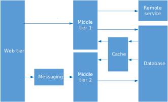
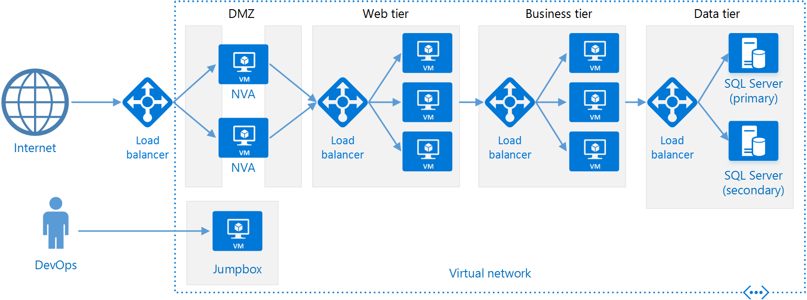

# N-tier architecture

An N-tier architecture divides an application into **logical layers** and **physical tiers**. 

Layers are a way to separate responsibilities and manage dependencies. Each layer has a specific responsibility. A higher layer can use services in a lower layer, but not vice-versa. 

Tiers are physically separated, running on separate machines. A tier can call to another tier directly, or use asynchronous messaging (message queue).

Although each layer might be hosted in its own tier, that’s not required. Several layers might be hosted on the same tier. Physically separating the tiers improves scalability and resiliency, but also adds latency from the additional network communication. 

An N-tier application can have a **closed layer architecture** or an **open layer architecture**.

- In a closed layer architecture, a layer can only call the next layer immediately down. 
- In an open layer architecture, a layer can call any of the layers below it. 

A closed layer architecture limits the dependencies between layers. However, it might create unnecessary network traffic, if one layer is simplying passing requests along to the next layer. 

A traditional three-tier application has a presentation tier, a middle tier, and a database tier. The middle tier is optional. More complex applications might have more than three tiers. The diagram above shows an application with two middle tiers, encapsulating different areas of functionality. 

## When to use this architecture

N-tier architectures are typically implemented as IaaS applications, with each tier running on a separate set of VMs. However, an N-tier application doesn’t need to be pure IaaS. Often, it's advantageous to use managed services for some parts of the architecture, particularly caching, messaging, and data storage.

Consider an N-tier architecture for:

- Simple web applications. 
- Migrating an on-premises application to Azure with minimum refactoring.
- Unified development of on-premises and cloud applications.

N-tier architectures are very common in traditional on-premises applications, so it’s a natural fit for migrating existing workloads to Azure.

## Benefits

- Portability between cloud and on-premises, and between cloud platforms.
- Less learning curve for most developers.
- Natural evolution from the traditional application model.
- Open to heterogeneous environment (Windows/Linux)

## Challenges

- It's easy to end up with a middle tier that just does CRUD operations on the database, adding extra latency without doing any useful work. 
- Monolithic design prevents independent deployment of layers/tiers.
- Managing an IaaS application is more work than a pure PaaS application that uses only managed services. 
- It can be difficult to manage the versioning of the code that is deployed on the VMs, making it challenging to update the application.

## N-tier architecture running on virtual machines

This section describes a recommended N-tier architecture running on VMs. 

Each tier consists of two or more VMs, placed in an availability set or VM scale set. Multiple VMs provides resiliency in case one VM fails. Load balancers  are used to distribute requests across the VMs in a tier. A tier can be scaled horizontally by adding more VMs to the pool. 

Each tier is also placed inside its own subnet, meaning their internal IP addresses fall within the same address range. That makes it easy to apply NSG rules and route tables to individual tiers.

The web and business tiers are stateless. any VM can handle any request for that tier. The data tier should consist of a replicated database. For Windows, we recommend SQL Server, using Always On Availability Groups for high availability. For Linux, we recommend Apache Cassandra. (SQL Server for Linux is currently in preview) 

Do not allow direct RDP or SSH access to VMs that are running application code. Instead, operators should log into a jumpbox, also called a bastion host. This is  VM on the network that administrators use to connect to the other VMs. The jumpbox has an NSG that allows RDP or SSH only from whitelisted public IP addresses.

### Additional considerations

- N-tier architectures are not restricted to three tiers. For more complex applications, it is common to have more tiers. In that case, consider using layer-7 routing to route requests to a particular tier.

- Look for places in the architecture where you can use a managed service without significant refactoring. In particular, look at caching, messaging, storage, and databases. 

- For high security, place a network in front of the application. The DMZ includes network virtual appliances (NVAs) that implement security functionality such as firewalls and packet inspection. For more information, see [Network DMZ][dmz].

- For high availability, place two or more NVAs in an availability set, with an external load balancer to distribute Interet requests across the instances. For more information, see [Deploy highly availabile network virtual appliances][ha-nva].

- You can extend the Azure virtual network to your on-premises network using a site-to-site virtual private network (VPN) or Azure Expressroute. For more information, see [Hybrid network][hybrid-network].

- If your organization uses Active Directory to manage identity, you may want to extend your Active Directory environment to the Azure VNet. For more information, see [Identity management][identity].

- If you need higher availability than the Azure SLA for VMs provides, replicate the application across two regions and use Azure Traffic Manager for failover. For more information, see [Run Windows VMs in multiple regions][multiregion-windows] or [Run Linux VMs in multiple regions][multiregion-linux].

[dmz]: ../../blueprints/dmz/index.md
[ha-nva]: ../../blueprints/dmz/nva-ha.md
[hybrid-network]: ../../blueprints/hybrid-networking/index.md
[identity]: ../../blueprints/identity/index.md
[multiregion-windows]: ../../blueprints/virtual-machines-windows/multi-region-application.md
[multiregion-linux]: ../../blueprints/virtual-machines-linux/multi-region-application.md